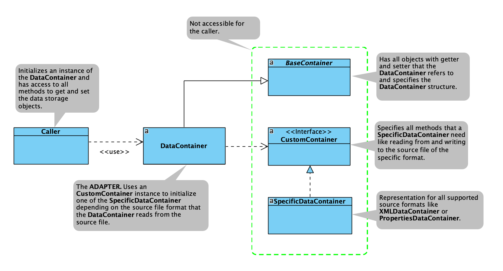

# Introduction

The <b>datastorage</b> concept arised to support developers to accomplish different data processing tasks. 

The idea is to use one object that is able to handle any data source. The internal data storage is unknown to the user 
and therefore the data access is similar for all source types.

The <b>DataContainer</b> class is the central element that has the methods available for the user.

The belonging package is build according to the <b>adapter design pattern</b>. 

There are specific container classes for the source types..
- CSV
- XML
- Properties
- JSON
- YAML and
- ResultSet of a database query. 

The <b>DataContainer</b> can be used directly or via the <b>Dispatcher</b> concept that is part of this documentation 
as well.