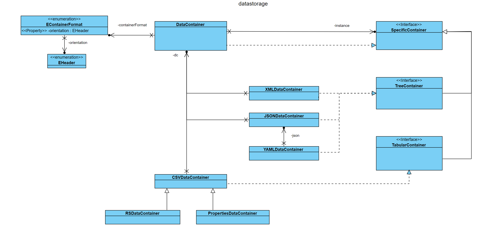

# Introduction

The <b>datastorage</b> concept was created to support developers to accomplish different data processing tasks. 

The idea is to use one object that is able to handle any data source. The internal data storage is unknown to the user 
and therefore the data access is similar for all source types.

The <b>DataContainer</b> class is the central element that has the methods that are available for the user. 
These methods are declared in the <b>TabularContainer</b> interface for tabular formats like CSV and in
the <b>TreeContainer</b> interface for tree formats like XML, JSON or YAML.
When a client uses a <b>DataContainer</b> instance it gets initialized as one of the specific container 
classes depending on the source string, file or stream. 

The belonging package is build according to the <b>brigde/facade design pattern</b>. 

There are specific container classes for the source types:
- CSV
- XML
- Properties
- JSON
- YAML and
- ResultSet of a database query. 

The <b>DataContainer</b> can be used directly or via the
[Dispatcher](https://github.com/LK-Test-Solutions/OpenTDK_Labs/blob/main/Documentation/Concepts/Dispatcher.md) 
classes.