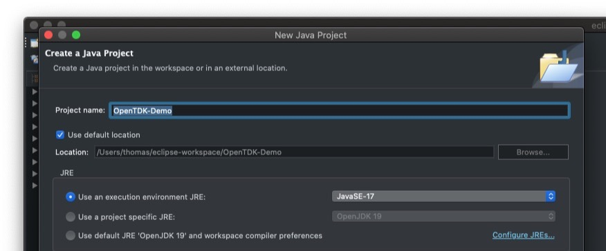
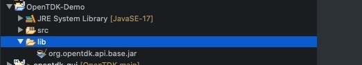
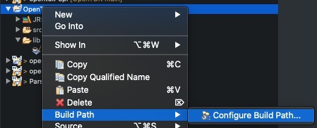
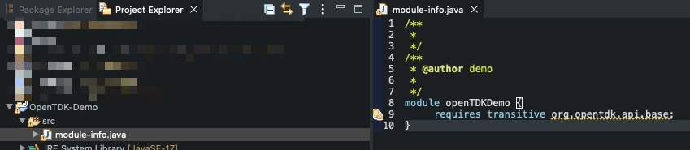
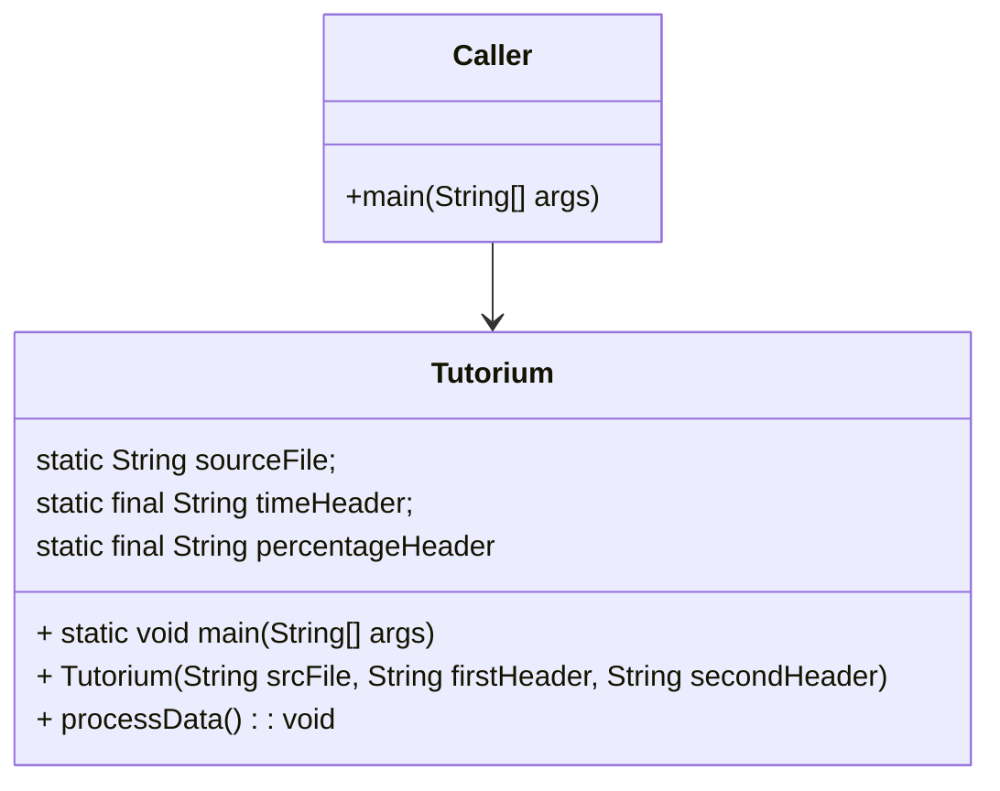
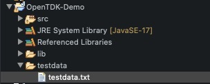
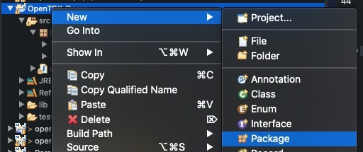
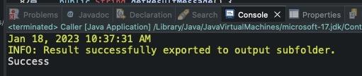
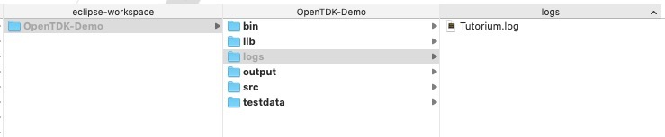

# Getting started with OpenTDK

Get started with the OpenTDK framework to build applications for data processing and manipulation.

| What you will build | What you will need |
|------------------ | ---------------- |
| You will build simple Java applications to process and manipulate data using the OpenTDK API framework  |- Have your Eclipse IDE installed and ready to use |
| | - 30 minutes|
| | - Download the OpenTDK API Java library|
| | - Download the source files for the examples|


### About this task

After set up and configuration of your Java development environment get started by completing these steps to create a basic application using the OpenTDK API framework. The example application will extract data from a file containing log data generated by a garbage collector.

### Downloads
* [Eclipse project for import](./Resources/EclipseProject/OpenTDK-Demo.zip)
* [Source files](./Resources/Source/Sourcefiles.zip)

## Step 1: Create and set up a Java Project in Eclipse for the demo OpentTDK application

1. Create project "OpenTDK-Demo"
    

    
Keep the option to auto create a "module-info.java" file ticked.

2. Create folder "lib" in the project folder structure and copy/move the downloaded OpenTDK JAR into this folder
    


3. Add OpenTDK lib to Build Path
    


4. Add OpenTDK module to module-info.java
    
Add "requires transitive org.opentdk.api.base;" to file "module-info.java
    


## Step 2: Create an application with the OpenTDK API framework

1. The use case

The testdata file contains log data from a garbage colector. We are interested to extract the timestamp in HH:MM:SS.sss format and mean value in percent which was calculated for a number of single log records for the GC activities. These values should be extracted from the source file a written to a new file in csv format.   
    
Example (data to be extracted marked in **bold**):

2020-06-15;**13:52:36.475**;WARNING;;base.logic.internal.GCMonitor$Worker;flush;"Total GC measuring **36,23%**"

2. Java classes

* Class "Caller.java" simulates a caller of the main class "Tutorium.java" which contains all the logic to extract and process the data from the datasource (in this case our GC logfile) using the OpenTDK API. Basically this caller class defines the data source and the column headers/columns for the output csv file containing the extracted data.
* In the main method of the main class Tutorium.java the class constructor and another method to trigger the business logic is called.
* There is an initializer block defined in Tutorium.java to set the applicationlogfile and the log level. The initializer block is always executed before the class constructor is called.

Class diagram:



Method to process data:

```Java
/**
 * The data processing routine of the {@link #Tutorium(String, String, String)} application.
*/
public void processData() {
    // Read data file
    DataContainer sourceContainer = new DataContainer(...);
    // Data container for results
    DataContainer resultContainer = new DataContainer();

    // Define column headers
    resultContainer.setHeaders(...);

    // Read data records from datafile, extract desired values and add to result container

    for (String[] row : sourceContainer.getRowsList()) {
        String value = ...;

        // Regular expression to define data to extract
        if (value.matches(...)) { ...
        resultContainer.addRow(...);
        }
    }

    try {
        // Check if Folder exists or create it if required
        FileUtil.checkDir(..);
        // Export results
        resultContainer.exportContainer(...);
    } catch (IOException e) {
        // Log exception using class MLogger
    }
    ...
```

3. Add the file containing the test data

Create a new folder "testdata" in the project root folder and copy the file "testdata.txt" into it.
    

    
The testdata file contains log data from a garbage colector.

4. Create new package lk.opentdkdemo
    


5. Copy Java source files to package folder

Copy files Caller.java and Tutorium.java to .../src/tk.opentdkdemo package folder

6. Run application

A "Success" message should be shown in the console window of the IDE after a successfull execution:
    

    
In addition two files are created:
    * a log file
    * a csv data file with the extracted data
    



