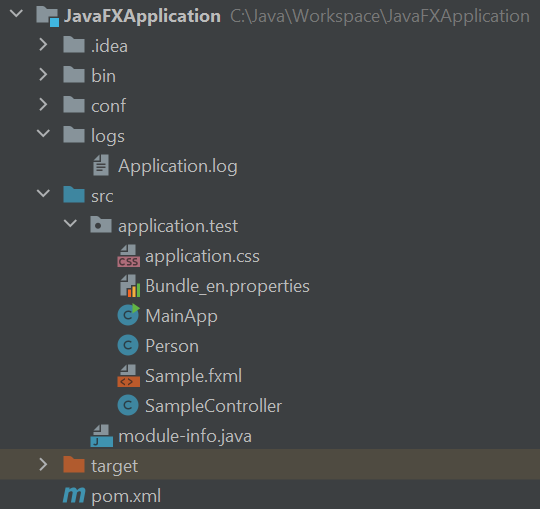

# Introduction

The goal of this tutorial is to create a JavaFX application with the following structure:

Now let's walk through the complete example on how to run the JavaFX application with FXML files:

- [createMainClass](createMainClass.md)
- [createControllerClass](createControllerClass.md)
- [createFxmlFile](createFxmlFile.md)

# Conditions

- Experience with Java and Maven
- Installed Eclipse or Intellij IDE
- [Installed JDK](https://jdk.java.net/ )