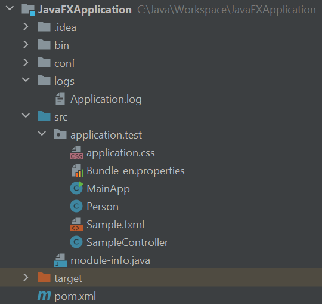

# Introduction

The goal of this tutorial is to create a JavaFX application with the following structure:

This is a Java Maven project created with Intellij by using ``File > New > Project..`` and then selecting
Java, Maven and the installed JDK.
With Eclipse it's the same menu navigation, but then you search for Maven instead. With other IDEs, like Visual Studio Code,
this will not be a problem as well.

Now let's walk through the complete example on how to run the JavaFX application with FXML files:

- [createProject](createProject.md)
- [createMainClass](createMainClass.md)
- [createFxmlFile](createFxmlFile.md)
- [createControllerClass](createControllerClass.md)

# Conditions

- Experience with Java and Maven
- Installed Eclipse or Intellij IDE or similar
- [Installed JDK](https://jdk.java.net/ )