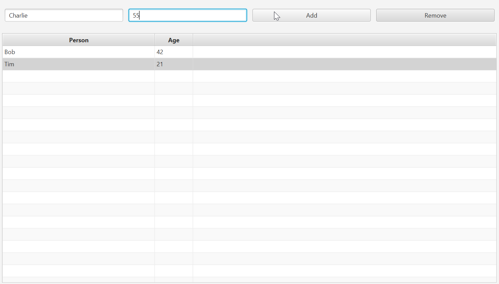

# How to create controller classes

Interfaces created with the SceneBuilder application are equipped with actions in Java controller classes to control the behavior.

In this example, the content of text fields is added to a table by clicking “Add” and the selected element is removed by “Remove”.



The class content copied in the last step in [createFxmlFile](createFxmlFile.md) must be copied to the IDE. 
The SceneBuilder application has already created a private field (instance of the element) for
each interface element provided with a fx:id and an ``initialize`` method that is the entry point into the controller class.
It is called automatically after initializing the GUI is complete. Inheritance from ``BaseController`` (extends) 
is required to allow the usage with a ``BaseApplication`` main class.

```java
package application.test;

import java.net.URL;
import java.util.ResourceBundle;
import javafx.fxml.FXML;
import javafx.scene.control.Button;
import javafx.scene.control.TableColumn;
import javafx.scene.control.TableView;
import javafx.scene.control.TextField;

public class SampleController extends BaseController {

    @FXML // ResourceBundle that was given to the FXMLLoader
    private ResourceBundle resources;

    @FXML // URL location of the FXML file that was given to the FXMLLoader
    private URL location;

    @FXML // fx:id="button_Add"
    private Button button_Add; // Value injected by FXMLLoader

    @FXML // fx:id="button_Remove"
    private Button button_Remove; // Value injected by FXMLLoader

    @FXML // fx:id="tableColumn_Age"
    private TableColumn<?, ?> tableColumn_Age; // Value injected by FXMLLoader

    @FXML // fx:id="tableColumn_Person"
    private TableColumn<?, ?> tableColumn_Person; // Value injected by FXMLLoader

    @FXML // fx:id="table_Person"
    private TableView<?> table_Person; // Value injected by FXMLLoader

    @FXML // fx:id="textField_Name"
    private TextField textField_Name; // Value injected by FXMLLoader

    @FXML // fx:id="textField_Age"
    private TextField textField_Age; // Value injected by FXMLLoader

    @FXML // This method is called by the FXMLLoader when initialization is complete
    void initialize() {
        assert button_Add != null : "fx:id=\"button_Add\" was not injected: check your FXML file 'Sample.fxml'.";
        assert button_Remove != null : "fx:id=\"button_Remove\" was not injected: check your FXML file 'Sample.fxml'.";
        assert tableColumn_Age != null : "fx:id=\"tableColumn_Age\" was not injected: check your FXML file 'Sample.fxml'.";
        assert tableColumn_Person != null : "fx:id=\"tableColumn_Person\" was not injected: check your FXML file 'Sample.fxml'.";
        assert table_Person != null : "fx:id=\"table_Person\" was not injected: check your FXML file 'Sample.fxml'.";
        assert textField_Name != null : "fx:id=\"textField_Name\" was not injected: check your FXML file 'Sample.fxml'.";
        assert textField_Age != null : "fx:id=\"textField_Age\" was not injected: check your FXML file 'Sample.fxml'.";
    }
}

```

Before we start with the actions, we need a class that represents a person in the list. 
This is a basic structure with private fields, constructor and getter methods for accessing the fields.

```java
public class Person {

	private String name;
	private int age;
	
	public Person(String name, int age) {
		this.name = name;
		this.age = age;
	}
	
	public String getName() {
		return this.name;
	}
	
	public int getAge() {
		return this.age;
	}
}

```

This allows the table and the table columns to be assigned to the ``Person`` type:

```
@FXML // fx:id="tableColumn_Age"
private TableColumn<Person, String> tableColumn_Age; // Value injected by FXMLLoader

@FXML // fx:id="tableColumn_Person"
private TableColumn<Person, String> tableColumn_Person; // Value injected by FXMLLoader

@FXML // fx:id="table_Person"
private TableView<Person> table_Person; // Value injected by FXMLLoader
```

Another private field is also required to hold the data displayed in the table.

````
private ObservableList<Person> data = FXCollections.observableArrayList();
````

In order to tell the table columns that they should display people, the settings for the cells must be set in the initialize method. Otherwise, no content appears.

````
tableColumn_Person.setCellValueFactory(new PropertyValueFactory<>("name"));
tableColumn_Age.setCellValueFactory(new PropertyValueFactory<>("age"));
````

Now it comes to the behavior of the buttons. This also happens in the initialize method.

For the addition, it is first checked whether the entries in the text fields are valid. A new person is then added to the list and then placed in the table.

````
 button_Add.setOnAction(event -> { 
  	String name = textField_Name.getText();
  	String age = textField_Age.getText();
  	if(!name.isBlank() && !age.isBlank()) {
  		int iAge;
  		try {
  			iAge = Integer.parseInt(age);
  		} catch(NumberFormatException e) {
  			System.out.println("No valid age defined.");
  			return;
  		}
  		data.add(new Person(name, iAge));
  		table_Person.setItems(data);
  	}
});
````

For the removal the selected person gets removed from the list and finally the adjusted data is set back in the table.

````
button_Remove.setOnAction(event -> {
	Person toRemove = table_Person.getSelectionModel().getSelectedItem();
	data.remove(toRemove);
	table_Person.setItems(data);
});
````

If previously made application settings need to be reloaded, this must be done in a method outside of ``initialize``, 
which is then called in the main class. In this example, default values are set again with each new call. However,
the data could also be saved in a file and be reloaded here.

````
public void reload() {
	data.add(new Person("Bob", 42));
	data.add(new Person("Tim", 21));
	table_Person.setItems(data);
}
````

Now the application is executable. 

**The whole project is available as ``JavaFXApplication`` folder in the [Sample-Projects](https://github.com/LK-Test-Solutions/OpenTDK_Labs/tree/main/Sample-Projects) section.**