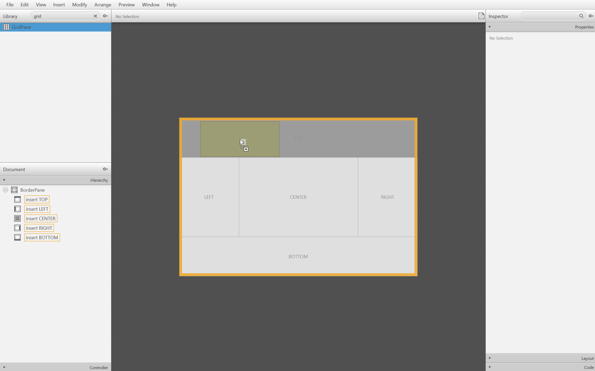
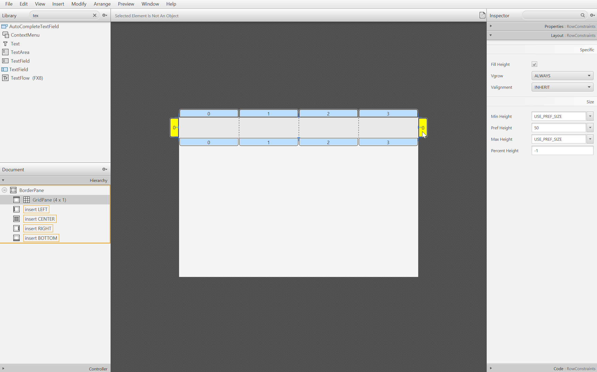
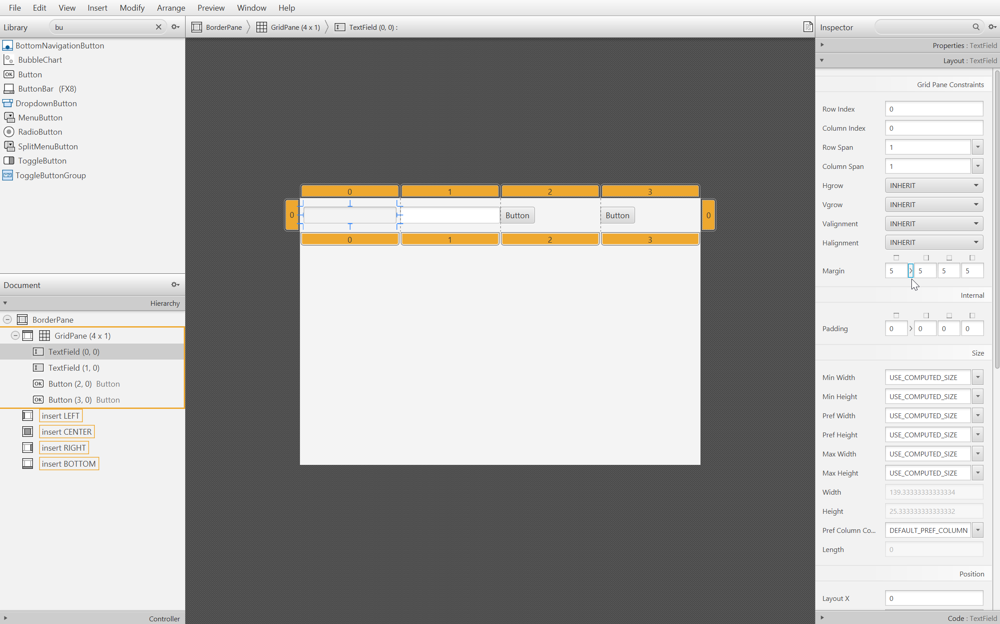
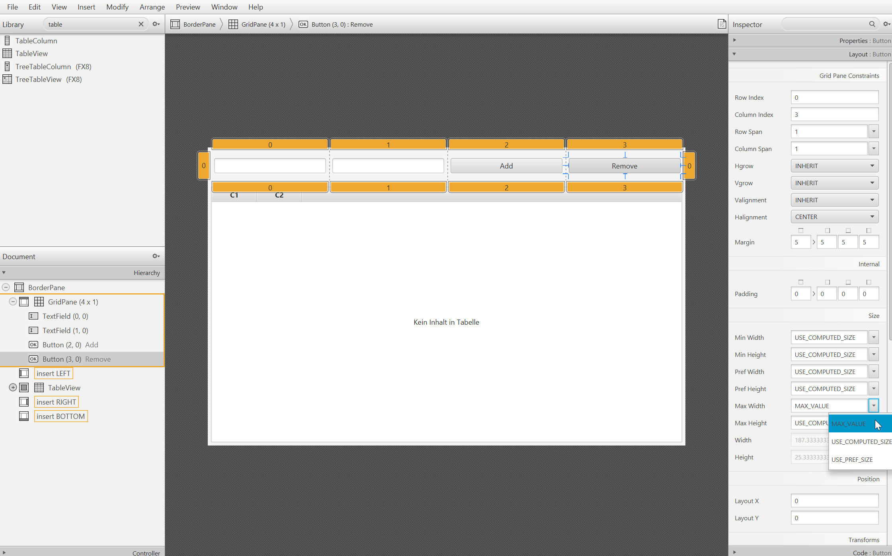

# Build FXML files

**Prerequisite: Installed [SceneBuilder](https://gluonhq.com/products/scene-builder/) application**

Let's have a look at this tool. It is designed to create FXML files without typing the XML structure but using GUI 
elements. This saves a lot of time.

The following areas are the most important ones:

1. List of all available GUI elements. Use the search function to get the required one more quickly.
2. Object tree that shows all already used elements
3. Workspace to drag and drop the elements into
4. Area to edit the elements settings with the sections *Properties*, *Layout* and *Code*. More details in the example below.

Important to mention is the controller section below of area 2. There you have the possibility to type in the classpath of the
belonging controller class. In case that the FXML file and the class are in the same project or package (which is highly recommended),
SceneBuilder proposes the available classes. No let's go through the basic functions of the tool.

### Example for this tutorial: Edit a table with persons

Drag a new ``BorderPane`` into the workspace.

Drag new ``GridPane`` in the top area.

Add/Remove rows and columns until there are one row and four columns.

Set the properties for the first row according to the settings on the right. This causes a fixed height of 50 pixel.

Place a ``TextField`` in the first and the second column and a ``Button`` in the third and fourth column.

Define a ``TextField`` margin of 5 so the elements are not too close to the border.

Center the buttons.

Drag a ``TableView`` to the center of the ``BorderPane`` and set a margin as well.

Double-click the buttons to set an **Add** and **Remove** text and set the width to maximum to fill the whole column.

Name the table columns as well and set a width of 300 for the left column to have enough space.

Now one of the most important things. Every GUI elements that should be accessible in the code needs a fx:id. 
To do that use the ``Code`` section on the right. Note: To give a fx:id for the table columns just click on the header.

**Suggestion:**
- Person text field : ``textField_Name``
- Age text field : ``textField_Age``
- Add button : ``button_Add``
- Remove button : ``button_Remove``
- Person column : ``tableColumn_Person``
- Age column : ``tableColumn_Age``
- Table view : ``table_Person``

Now select the controller class.

