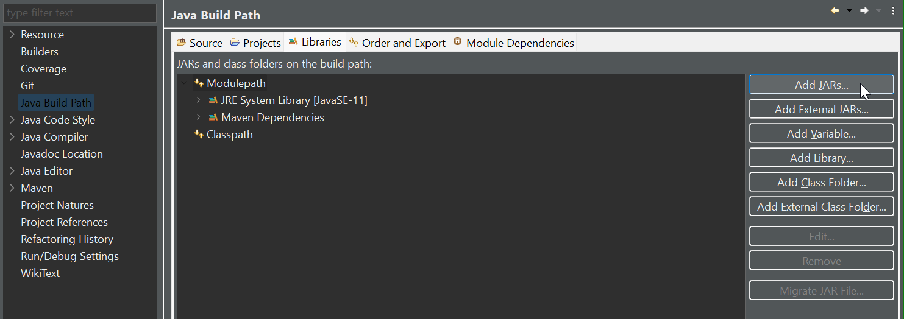
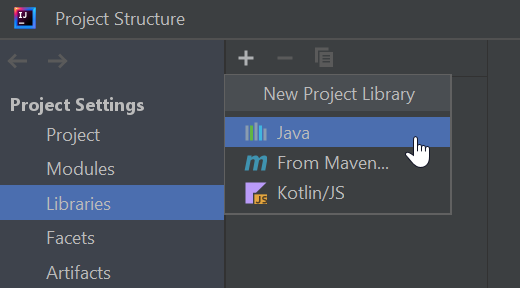

# Prior information

The Maven dependency is in work and will be available like this:

```
<dependency>
	<groupId>org.opentdk</groupId>
	<artifactId>opentdk-api</artifactId>
	<version>1.6.0</version>
</dependency>
<dependency>
	<groupId>org.opentdk</groupId>
	<artifactId>opentdk-gui</artifactId>
	<version>1.5.9</version>
</dependency>
```

<b> No JAR file download is necessary and the rest of this page can be skipped. Simply add the dependencies 
to the pom.xml file of your project.</b>


# Download the JAR files

Browse to the main page https://github.com/LK-Test-Solutions/OpenTDK and download the JAR files and dependencies that
are linked in the README file. The <b>opentdk-api</b> is always required and the <b>opentdk-gui</b> only if you like 
to set up a JavaFX GUI application. 


# Import the JAR files into your project

When using <b>Eclipse</b> you have to right-click on the project and select <i>Properties</i>. In the tree section 
<i>Java Build Path</i> go to the <i>Libaries</i> tab and select Add JARs...



It is recommended to already have the JARs available in the belonging project. To point to an external location use 
<i>Add External JARs</i>. 

When using <b>Intellij</b> go to <i>File > Project Structure</i> and select <i>Libraries</i> under 
<i>Project Settings</i>. Add a new Java library and choose the JAR files.




